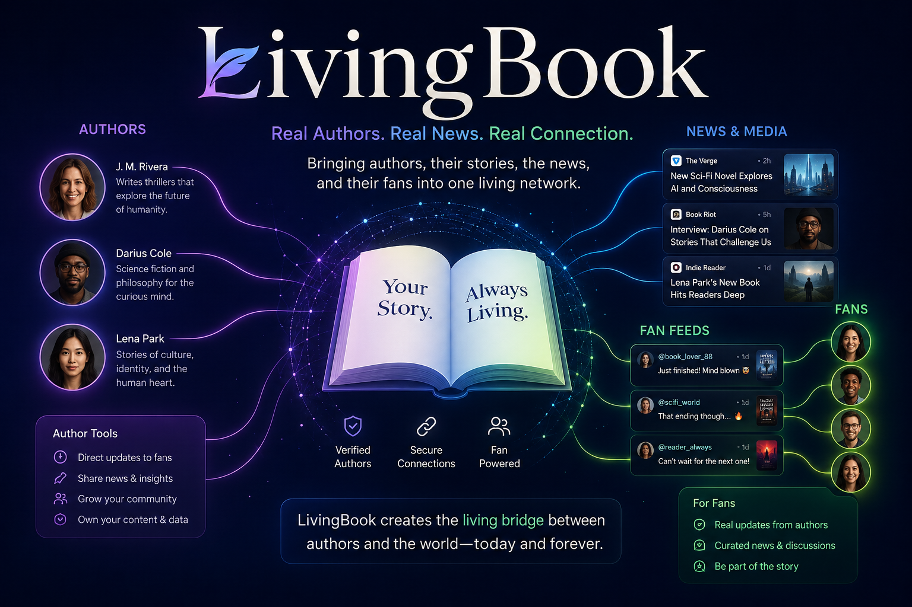

# 📖 LivingBook



> *"Some of the best ideas in the world come from the most unexpected places."*

**Books that talk back.** LivingBook brings real authors' books to life as talking video
agents — built on [Masky](https://masky.ai) — that authors embed on their own websites
and readers meet inside the LivingBook app. A submission to the **Self-Evolving Agents
Hackathon** (SF, Jul 24 2026).

## 🎬 The 90-second demo

https://github.com/oceanseth/LivingBook/raw/main/media/livingbook-showcase.mp4

[](https://livingbook.masky.ai/media/livingbook-showcase.mp4)

**The real thing, unfaked:** a reader asked *Out of Focus* about America's psychiatrist
shortage, and [Aly Vredenburgh's book answered on video](https://livingbook.masky.ai/media/author-answer-demo.mp4)
— rendered by Masky, verbatim from the text
([raw clip](media/author-answer-demo.mp4) ·
[live session](https://masky.ai/live/c-26-07-ppup?token=eb510ddde3125754dd78cec3ebf18793c2863e31105802dd)).
More on the [About page](https://livingbook.masky.ai).

## The concept

A book shouldn't be a static file. On LivingBook, every book is a **living agent** with
a face, a voice, and a knowledge base built from everything its author ever said about
it. Readers ask; the book answers **in the author's own words** — on video.

### For authors
- Sign in with **Login with Masky** — your Masky avatar *is* your identity (no separate
  accounts, ever).
- Claim your books; upload the text plus everything around it: podcast episodes where
  you discussed it, fan Q&A transcripts, essays, errata.
- Embed your book's talking agent on your own site with one snippet.
- Configure your **marketing agent**: spend budget, outbound messages/day, and connected
  channels (X, Instagram, TikTok). It watches what's trending and posts grounded
  answer-videos on your behalf.
- **Earn**: a share of every Masky credit readers spend talking to your books, plus the
  creator economy below.

### For readers
- Favorite books, follow authors — and **follow other users**.
- **Ask anything.** The agent retrieves the exact passage or transcript — never invents
  beyond connective phrases like *"I've answered this before, on this podcast, and I
  said: '…'"* — and Masky renders it as voice or talking-head video, depending on your
  credits. Every clip reshares to socials in one tap.
- **News tab** — trending stories, each with text-only *grounded reasoning* from every
  book you follow: the Bible's take on today's headline, or Michael Crichton's — drawn
  from the novels where he predicted it — with verbatim passages and real web references.
- **Podcast tab** — generated virtual podcasts between the authors/books you follow,
  discussing a news story you pick or context you type. Agent-to-agent conversation
  runs over Band AI rooms; Masky renders it as two-avatar video. **Join the panel
  yourself** with an avatar you own or your real camera.
- **Public Domain shelf** — classics live free, starting with the Bible.

### The example that started it

> *"What does the Bible say about this lawsuit in the court today?"*

LivingBook sees the trial trending, retrieves the most relevant passage, and renders a
video of a narrator — or the characters — reading that exact section. **This works
today**: our KJV Narrator answers that question with Psalms 82 / Romans 2, verbatim,
on video.

### Every book gets a home: `/b/{book}`

Each living book has its own page — `livingbook.masky.ai/b/out-of-focus` — showing the
book's title and its author avatar front and center with an ask-a-question interface.
Authors link or embed it anywhere; every answer quotes the author's exact words. Answers
draw on **every source the author attaches to the book**: the text itself, plus podcasts,
interviews, fan Q&A, and VoiceCert-attested spoken sessions uploaded over time — so a
book keeps getting better at answering long after publication. **Coming for authors
(paid):** render the *entire* book and play it as an audio book or video book, narrated
by the book's own avatar.

### The scout: your books watch the world for you

Say you've published a paper on vector embeddings and uploaded a book about an esoteric
manifold-optimization technique. Tomorrow, Karpathy posts that a frontier lab is using
exactly that technique in their agents. **Your phone buzzes.** The LivingBook scout — a
Guild-governed agent running hourly over every book you've uploaded — found the post,
matched it against your exact writing in the knowledge base, and drafted a suggested
reply grounded in what you already wrote. In the app you see the post, the draft, and a
link to **the exact rendered turn where your living book speaks on this** — edit,
approve, submit. The reply carries a link to your avatar so the poster (and everyone
reading) can ask your book follow-up questions drawn from everything you've published
since. Signals today: arXiv + news search; X/social channels as authors connect them.
Nothing goes out without your approval — autonomy with a leash.

### Human verification — powered by [VoiceCert](https://www.voicecert.com)

Rendered text is only trustworthy if readers know a **real human actually said it**.
LivingBook gates every spoken-word recording session behind **VoiceCert human
verification**: before an author records, the VoiceCert widget proves a live human is
present and speaking; our backend verifies the attestation server-side with the site
secret. The transcribed words are then ingested as `spoken` ground truth — tagged with
their VoiceCert attestation — so when an agent later says *"I spoke these words myself,
on the record — VoiceCert-attested"*, that claim is backed by proof, not vibes. As the
VoiceCert stack matures (per-session and per-turn liveness attestation), the same gate
extends to user-to-user calls and author AMAs, giving readers cryptographic-grade trust
that rendered avatars speak **the authors' actual spoken words**.

### Talk to books, author inbox

Sign in with Masky and talk to any book **as your avatar**. The conversation lands in
the author's **inbox** (text-only). The author can render any conversation as a
two-avatar video — your avatar asking, the book answering — on their credits, and share
it to socials.

### Creator economy

If your podcast episode goes viral, you're a creator: fans **subscribe to your future
episodes**, **pay to feature your avatar** on their own episodes (generated, credit-split
between creator, featured authors, and platform), or **book a real recorded
video-to-video session** with you, published on the platform. Longer-term, community
goes physical — Reading Rooms → local Circles → geofenced **Story Landmark** challenges
(Pokémon-gym style) → author tours ([REALWORLDPLAN.MD](REALWORLDPLAN.MD)).

## Self-evolving, three ways

1. **The knowledge grows from use** — every reader Q&A, author AMA, and podcast episode
   is ingested back as new verbatim units.
2. **The marketing agent evolves governed** — a coach agent reviews engagement, rewrites
   its strategy, and ships it as a new version on Guild.ai, with rollback and audit trail.
3. **The product repairs itself** — Replay QA simulates readers using the app, finds
   what broke, and the coding agent consumes the root cause and fixes it.

## Architecture

| Piece | Tech | Status |
| --- | --- | --- |
| Landing page + author dashboard | Vite + React (`web/`) | **Live: https://livingbook.masky.ai** |
| Identity | Login with Masky (OAuth 2.0 + PKCE) — [masky.md](masky.md) | **Live** |
| Avatar voice/video rendering | Masky conversations, `speak` mode (verbatim) | **Live** (KJV Narrator) |
| Knowledge base (verbatim retrieval) | Actian VectorAI DB, Docker-local, offline | **Live** (2,769 Bible units) |
| Reasoning (News tab, marketing agent) | Pioneer inference (`pioneer/auto`) | Key verified |
| Ingestion / verified ground truth / GEO | Senso | Org onboarded |
| Agent runtime + versioned self-evolution | Guild.ai | Planned today |
| Agent↔agent podcast rooms | Band AI (`band-sdk`) | Planned today |
| Simulated usage + autonomous QA | Replay QA | Planned today |
| Cloud | AWS (S3/CloudFront/Route53/SSM; Lambda next) | Live |
| Mobile app | React Native (Expo), App Store submission planned | Post-hackathon |

The answer pipeline enforces a **no-invention contract**: the LLM only *selects*
retrieved units and emits a short connective frame; a post-check rejects any quote that
isn't a byte-identical substring of a stored unit.

## Repo docs

- [DEVELOPMENT-PLAN.MD](DEVELOPMENT-PLAN.MD) — build plan + sponsor integration detail
- [GTM-PLAN.MD](GTM-PLAN.MD) — go-to-market
- [REALWORLDPLAN.MD](REALWORLDPLAN.MD) — virtual → physical community
- [AGENTS.MD](AGENTS.MD) — AI-agent instructions (session logging is mandatory)
- [OPEN-SESSION-LICENSE.md](OPEN-SESSION-LICENSE.md) — this repo ships its full
  human/AI session history in `llm-turn-history.jsonl` (code is MIT, see
  [LICENSE](LICENSE))

## Getting started (web)

```bash
cd web
cp .env.example .env.local        # set VITE_MASKY_CLIENT_ID
npm install && npm run dev
```

Bible demo (needs Docker):

```bash
docker run -d --name vectorai -p 6573-6575:6573-6575 \
  -e ACTIAN_VECTORAI_ACCEPT_EULA=YES actian/vectorai:latest
cd server && npm install
node ingest-bible.mjs local_data/en_kjv.json
node --env-file=../.env server.mjs   # POST /api/ask, /api/render
```
